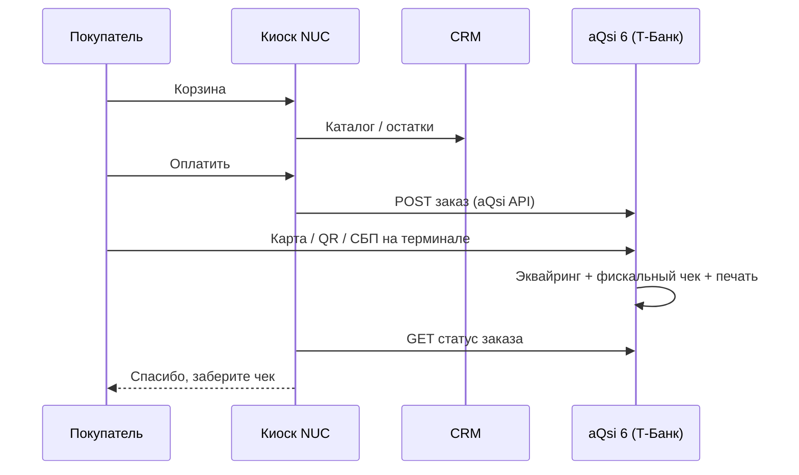
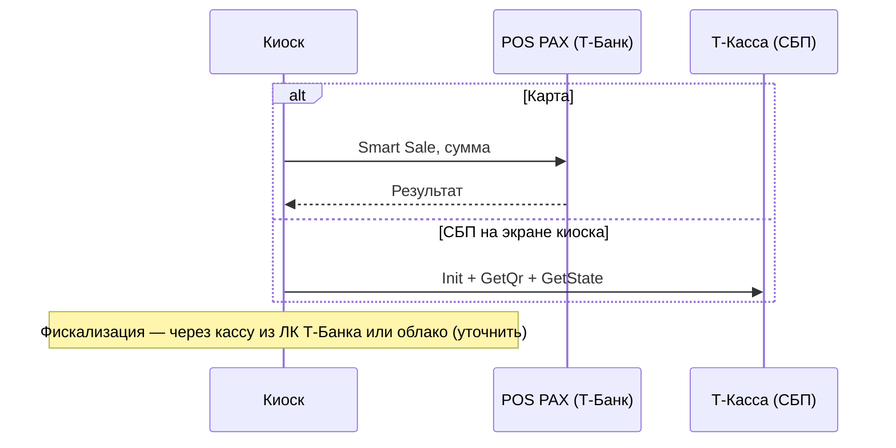

# Процесс оплаты и чека (Т-Банк first)

## Режим `tbank_aqsi` (основной)

| Этап | Исполнитель | Протокол |
|------|-------------|----------|
| Каталог | NUC → CRM | HTTPS (Wi‑Fi) |
| Создание продажи | NUC → aQsi Cloud | `https://api.aqsi.ru/` |
| Оплата + 54-ФЗ | **aQsi 6** | Встроенно (Т-Банк эквайринг) |
| Бумажный чек | **aQsi 6** | Встроенный принтер |

Документация aQsi: [интеграция по API](https://aqsi.ru/support/integraciya-po-vneshnemu-api/), [Orders](https://api.aqsi.ru/#tag/Orders).

---

## Режим `tbank_pos_printer` (POS + принтер, без УМКА)

См. подробно [08-tbank-pos-printer.md](08-tbank-pos-printer.md).

1. Киоск → **Smart Sale** → POS Т-Банк (оплата).
2. Киоск → **CloudKassir / Чеки Т-Бизнеса** (фискальный чек в облаке).
3. Киоск → **HS-K33** (бумажная копия для покупателя).

---

## Режим `tbank_pos_sbp`

- POS: [Smart Sale](05-tbank-terminal.md), порт **27015**
- СБП: [06-tbank-sbp-internet.md](06-tbank-sbp-internet.md)
- Отдельная УМКА **не требуется**, если подключена **онлайн-касса Т-Банка** (aQsi, CloudKassir из [списка](https://www.tbank.ru/business/help/business-payments/acquiring/online/integrate/))

---

## Режим `legacy_umka` (опционально)

См. архивную схему в [03-umka-01-fa.md](03-umka-01-fa.md) и [04-hs-k33-printer.md](04-hs-k33-printer.md).  
Использовать только если оборудование уже стоит на объекте.

---

## Порядок в коде

| Режим | После успешной оплаты |
|-------|----------------------|
| `tbank_aqsi` | `AqsiOrderService` — без `FiscalUmkaService` |
| `tbank_pos_sbp` | Оплата OK; фискализация — заглушка/TODO до выбора кассы Т-Банка |
| `legacy_umka` | `FiscalUmkaService` → опционально `PrinterHsK33Service` |
