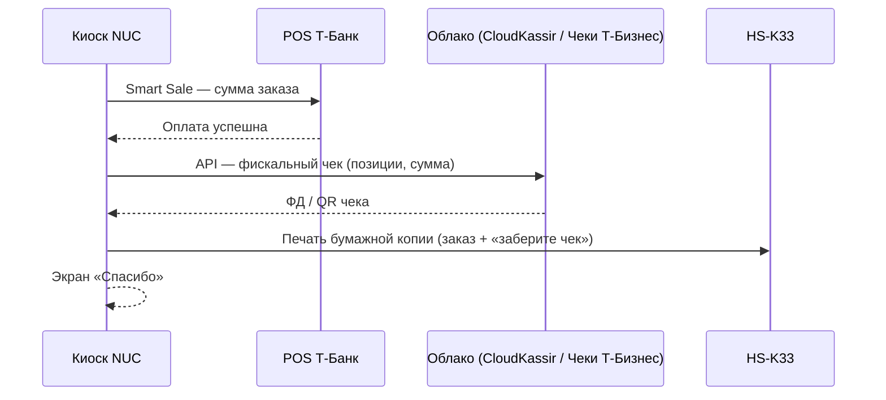

# Вариант: терминал Т-Банк + принтер чеков (без УМКА)

Подходит, если на объекте уже есть или планируются:

- **POS Т-Банк** (PAX AF6 / A8900 и т.п.) — оплата картой / QR на терминале  
- **HS-K33** (или аналог) — **бумажная копия** для покупателя  
- **Нет** УМКА-01-ФА на switch  

Режим в проекте: `hardware.integration_mode: tbank_pos_printer`

---

## Важно про 54-ФЗ

| Что печатает | Юридический статус |
|--------------|-------------------|
| Слип с **PAX** после оплаты | Подтверждение эквайринга, **не** всегда полноценный кассовый чек |
| Лента с **HS-K33** из киоска | Может быть **информационной** (заказ, сумма) — если киоск печатает сам |
| **Фискальный** чек в ФНС | Нужен отдельный источник — **не УМКА**, а решение Т-Банка |

### Как фискализировать без УМКА (через Т-Банк)

1. **Облачная касса CloudKassir** + привязка в ЛК интернет-эквайринга  
   [Инструкция Т-Банка](https://www.tbank.ru/business/help/business-payments/internet-acquiring/kassa/how-connect/)

2. **«Чеки Т-Бизнеса»** — сервис без отдельной «железной» кассы  
   [Облачная касса Т-Банка](https://www.tbank.ru/business/online-payments/cashreg/)

3. **Связка POS + касса из списка Т-Банка** (aQsi, Эвотор, 1С, …) по **Smart Sale** — тогда чек печатает **касса**, а HS-K33 только дубль (опционально)

Для киоска типичная связка **без УМКА**:

```
Оплата на PAX (Smart Sale)  →  Фискализация в облаке (API)  →  HS-K33 печатает копию для покупателя
```

---

## Схема сети (как в вашем ТЗ)

```
Роутер (интернет)
    ├── Wi‑Fi: NUC (киоск)
    ├── Wi‑Fi/LAN: POS Т-Банк
    └── Switch (LAN):
            ├── NUC (Ethernet)
            └── HS-K33 (Ethernet)
```

УМКА **не подключается**.

---

## Поток в приложении



Опционально **СБП на экране 32″**: Т‑Касса (интернет) → тот же облачный чек → принтер.

---

## Настройка `config/settings.yaml`

```yaml
hardware:
  integration_mode: tbank_pos_printer

  tbank_terminal:
    host: "192.168.1.102"
    port: 27015
    smart_sale_enabled: true
    use_mock: false

  printer:
    enabled: true
    host: "192.168.1.101"
    port: 9100
    connection: ethernet

fiscal:
  enabled: true
  provider: cloudkassir   # cloudkassir | tbusiness | none
  # ключи CloudKassir / Т-Бизнес — в .env, не в git

legacy:
  umka: false   # явно: УМКА не используется
```

---

## Код

| Модуль | Роль |
|--------|------|
| `payment_card.py` | Smart Sale → POS |
| `payment_sbp.py` | СБП на экране (опционально) |
| `fiscal_cloud.py` | CloudKassir / Чеки Т-Бизнес (заглушка + TODO API) |
| `printer_hs_k33.py` | Бумажная квитанция |
| ~~`fiscal_umka.py`~~ | **Не вызывается** |

---

## Что запросить в Т-Банке

1. PAX: Smart Sale, IP, SDK для Windows.  
2. Фискализация: **CloudKassir** или **Чеки Т-Бизнеса** + API для киоска после оплаты.  
3. Можно ли автоматически пробивать чек по сумме с POS без ручного ввода в ЛК.  

Тел.: **8 800 700-66-66**

---

## Сравнение с aQsi 6

| | **PAX + принтер** | **aQsi 6** |
|---|-------------------|------------|
| Устройств | 2 (+ облако) | 1 |
| УМКА | Нет | Нет |
| Фискализация | Облако / касса из ЛК Т-Банка | Встроена в aQsi |
| Бумага | HS-K33 | Встроенный принтер aQsi |
| Сложность | Выше (3 интеграции) | Ниже |

Если принтер HS-K33 уже в корпусе киоска — вариант **PAX + принтер** оправдан. Если закупка с нуля — чаще проще **aQsi 6**.
